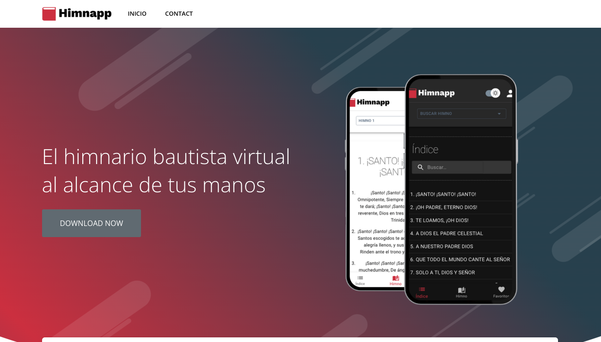
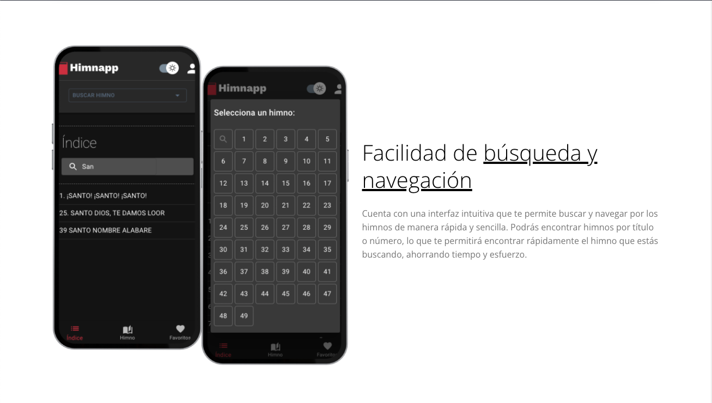
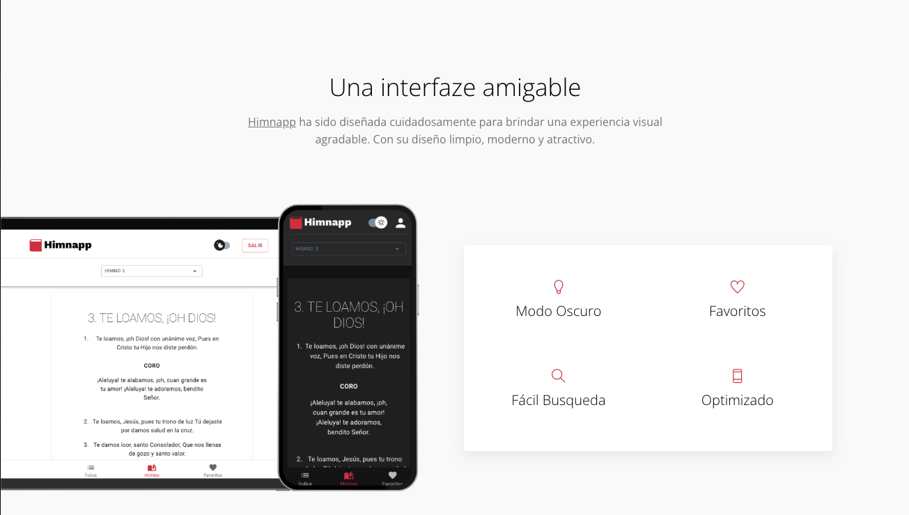
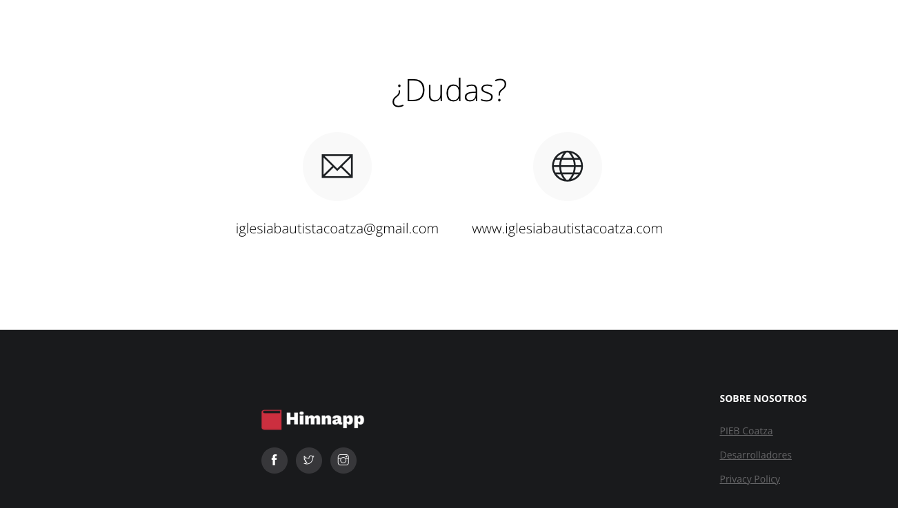

# Himnapp - Website

## Example Site
|  |  |
|:---:|:---:|
| **Homepage**  | **Sección 1**  |
|  |  |
| **Sección 2** | **Footer** |

## Table of contents

- [Overview](#overview)
  - [Links](#links)
- [My process](#my-process)
  - [Pages](#pages)
  - [Resources](#useful-resources)
- [Author](#author)

## Overview

### Links

👉🏻 Code: [Code URL](https://github.com/vianydev/himnappweb)

👉🏻 Live Site URL: [View Live Preview](https://vianydev.github.io/himnappweb/)

## My process

<!-- resources -->
### Pages

* **Homepage**
* **FAQ**
* **Coming Soon**
* **404**
* **Privacy Policy**

<!-- resources -->
### Resources

Some third-party plugins that we used to build this template. Please check their license.

* **Bootstrap v5.3.0-alpha3**: <https://getbootstrap.com/docs/5.3/getting-started/download/>
* **Jquery v3.5.1**: <https://jquery.com/download/>
* **Themify Icons**: <https://themify.me/themify-icons>
* **Google Fonts**: <http://fonts.google.com/>
* **AOS**: <https://michalsnik.github.io/aos/>
* **Fancybox**: <http://fancyapps.com/fancybox/>
* **Slick**: <https://kenwheeler.github.io/slick/>
* **SyoTimer**: <http://syomochkin.xyz/folio/syotimer/demo.html>

## Author

☕️ Designed & Developed by [vianydev](https://vianydev.github.io)
- Twitter - [@vianydev](https://www.twitter.com/vianydev)
- Linkedin - [@vianydev](https://www.linkedin.com/in/vianydev/)
- Github - [@vianydev](https://github.com/vianydev)

